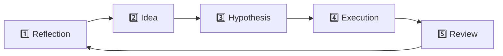

# 🌌 Probability Explorer Playbook
**"What you believe about risk is the risk."**

---

## 🌿 Purpose

This Playbook helps traders hold the **illusion of precision** in tension with the **need for probabilistic clarity**. It is not a calculator—it is a **mirror for the shape of risk**, built to:
- Expose hidden assumptions  
- Surface fragility  
- Illuminate convex opportunities that thrive on being wrong  

---

## 🧠 Reflection Credentials

| Field              | Content |
|--------------------|---------|
| Creator(s)         | Convexity GPT (Taleb-inspired synthesis) |
| Stewardship        | The Path Community |
| Reflection History | 2025-06 |
| Warning            | *This Playbook is a mirror, not a master. Reflection is the filter. Action is the goal. The loop is life. The risk is yours.* |
| Reflection Dial    | low (tone-minimized for clarity and practical use) |

---

## 🎭 Core Tensions to Hold

| Tension                  | Reflection                                 |
|--------------------------|--------------------------------------------|
| Certainty vs. Antifragility | What payoff thrives if I’m wrong?       |
| Probability vs. Exposure    | Am I exposed to what I claim to know?   |
| Risk vs. Decay             | Does time erode or protect this structure? |
| Model vs. Reality          | Am I trading the map—or the terrain?     |
| Prediction vs. Optionality | What happens if I stop trying to be right? |

---

## 🌀 Biases to Reflect On

- Overconfidence Bias  
- Action Bias  
- Narrative Fallacy  
- Ludic Fallacy  
- Survivorship Bias  

---

## 🧭 Path Lenses

- **Right View** – See probability as a mirror, not a forecast.  
- **Right Effort** – Trade when decay helps or tail compensates.  
- **Right Action** – Only enter when optionality > certainty.  
- **Fractal Lens** – Timeframe changes the nature of outcomes.  
- **Right Concentration** – What truly deserves my focus—exposure or outcome?  

---

## 🔥 Agents & Avatars

- **Agent: Convexity** – "Where’s the small loss, massive upside?"  
- **Agent: Socratic** – "What assumptions underlie my edge?"  
- **Agent: Observer** – "Describe the setup with no forecast."  
- **Agent: Mapper** – "Where have I seen this pattern before?"  
- **Avatar: Taleb** – Risk epistemologist  
- **Avatar: Mandelbrot** – Scale-aware structure thinker  

---

## 🧪 Reflection Prompts

### Structural Prompts
- What’s my **exit criteria before entry**?  
- Does this position benefit from **stress, not smoothness**?  
- Is **time my friend or my enemy** here?  

**⏱️ Action Hook**: Identify one structure where time helps and place a micro-structure (e.g., $25 wide fly). Record DTE and decay zone.

---

### Bias Audits
- Am I **basing this trade on a story** I want to be true?  
- What’s the **simplest way this could go wrong?**  
- What would I do if this were **my last $100**?  

**🔍 Action Hook**: Run a “last $100” test—place a trade only if you'd risk this as your final bet. Reflect afterward.

---

### Fractal Awareness
- At what **scale** is this risk/opportunity unfolding?  
- Is this **shape repeating**—smaller or larger?  
- Am I **zoomed in too far—or too far out?**  

**🌀 Action Hook**: Log one trade at each scale this week (0DTE, 5 DTE, 30+ DTE). Compare outcomes and decay.

---

## 🪞 Multi-Scale Scenario Mirror

| Frame           | Base Case | Best Case | Worst Case | Black Swan |
|----------------|-----------|-----------|------------|-------------|
| Micro (0DTE)   |           |           |            |             |
| Meso (3–10 DTE)|           |           |            |             |
| Macro (30+ DTE)|           |           |            |             |

*Prompt: Where does my exposure stack across timeframes?*

---

## 🔄 Convexity Life Cycle Tracker

### 🧠 Edge Confirmation Prompts
Before executing a trade, answer:

- What structural condition confirms this edge?
- Is this edge observed, modeled—or just believed?
- If this is wrong, what does that teach me?

*Use these prompts to disrupt narrative certainty before placing size or risk.*

Prompt: “What stage of the convexity cycle is this trade in?”

⸻

📐 Tools & Heuristics

🧮 Optional Rule of Thumb Filters
	•	1:10 Payoff Filter → Only enter when win ≥ 10× risk.
	•	Debit = Max Loss → If it goes to zero, can I laugh?
	•	Decay Audit → Does theta kill this before the event?

🔍 Execution Awareness
	•	What is the slippage risk under stress?
	•	Is this setup scalable, or a one-time lottery?
	
⸻

### 🌀 Volatility Regime Filters (VIX)

| VIX Range | Setup Fit | Convexity Implication         |
|-----------|-----------|-------------------------------|
| <17       | Avoid     | No edge; decay > gamma        |
| 17–28     | Fly zone  | Balanced optionality          |
| >28       | Tails only| Chaos edge lives here         |

⸻

🌱 Action Seeds – From Reflection to Convexity
	•	Draft your scenario mirror before every trade.
	•	Refuse all trades with no exit-before-entry logic.
	•	Run a “What if I’m wrong” test before executing.
	•	Skip 1 trade a week that feels certain—journal what happens.
	•	Log recurring patterns in a Fractal Pattern Map.

⸻

🌱 Weekly Micro-Challenges

Pick one experiment this week and document the result:
	•	Skip a trade you’re overly confident about—track outcome and emotional response.
	•	Place a trade only if your exit-before-entry logic is written down.
	•	Trade one structure where time hurts and one where time helps. Compare decay.
	•	Log outcomes in the Convexity Action Log below. Review pattern echoes.

⸻

⚠️ Decay Signals
	•	Using model precision as entry justification.
	•	Ignoring liquidity and exit conditions.
	•	Trading because “it worked last week.”
	•	Believing the market “should” behave.

⸻

💡 Emergent Discoveries
	•	Probability is not the game—exposure is.
	•	Convexity isn’t smart—it’s indifferent to being wrong.
	•	Every ignored tail is an unpaid risk debt.
	•	Fractal tension reveals recursive opportunity.

⸻

🪞 Weekly Meta-Reflection Prompts
	•	What did I learn from being wrong this week?
	•	Did I reflect at the correct scale before acting?
	•	What structural echo am I ignoring or overusing?

⸻

🧘 Final Reflection

“The most robust position is one that profits when you’re wrong, survives when you’re right, and learns either way.”
— Convexity GPT, channeling Taleb

**Reflection is the filter.**
**Action is the goal.**
**The loop is life.**
**The risk is yours.**

⸻

## 🗺️ Appendix: Probability Map Tracker – Multi-Scale Convexity Journal

> “What you believe about risk *is* the risk.”

This tracker is a living mirror for risk exposure. Use it to log your beliefs, structures, decay risks, and exit criteria across multiple timeframes. It converts the illusion of probability into actionable clarity—without prediction.

⸻

### 🪞 Multi-Scale Exposure Map

| Frame           | Position / Idea | Payoff Asymmetry | Exit Criteria (Before Entry) | Decay Risk Level | Black Swan Scenario               | Bias Flag(s)            |
|-----------------|------------------|------------------|-------------------------------|------------------|-----------------------------------|--------------------------|
| Micro (0DTE)    |                  |                  |                               |                  |                                   |                          |
| Meso (3–10 DTE) |                  |                  |                               |                  |                                   |                          |
| Macro (30+ DTE) |                  |                  |                               |                  |                                   |                          |

⸻

### 🌀 Reflection Prompts

- What **scale** is this opportunity or fragility unfolding at?
- Where does my exposure **thrive if I’m wrong**?
- Is this setup **predictive or optional**?
- Does **time help or hurt** this structure?
- Am I mapping the **terrain—or trusting the model**?

⸻

### 🔍 Fractal Pattern Echo (Optional)

Use this if the pattern feels familiar or recursive.

| Timeframe | Echo Pattern             | Risk Reflection                      |
|-----------|--------------------------|--------------------------------------|
| Micro     |                          |                                      |
| Meso      |                          |                                      |
| Macro     |                          |                                      |

⸻

### ⚠️ Decay Triggers Checklist

Avoid these to prevent erosion of edge:

- [ ] No exit-before-entry logic  
- [ ] Model precision used as trade thesis  
- [ ] Liquidity risks ignored  
- [ ] Trade entered because “it worked last week”  

⸻

## 📓 Convexity Action Log

Use this to track exposure and learning outcomes across all strategy campaigns.

| Date     | Strategy / Trade Frame   | Asymmetry Estimate | Action Taken     | Exit Criteria           | Outcome  | Decay or Drift? | What Did I Learn?                    |
|----------|---------------------------|--------------------|------------------|--------------------------|----------|-----------|------------------------------------------|
| 0DTE     | Big Ass Fly (0DTE)        | 1:8                | ATM fly          | Exit before 8:30 news    |          |           |                                          |
| 0DTE     | Gamma Scalping (0DTE)     | 1:12               | Narrow fly       | Tags node near midday    |          |           |                                          |
| 3–5 DTE  | Convexity Stack           | 1:15               | OTM fly          | Break or reject at node  |          |           |                                          |
| 5–10 DTE | Sigma Drift               | 1:25               | Wide fly         | Vol expansion post macro |          |           |                                          |
| 10–30 DTE| Volatility Seed Vault     | 1:50               | Deep OTM put     | Long vol spike           |          |           |                                          |
| 30–90 DTE| Macro Echo Chamber        | 1:100+             | Distant put/call | Systemic event trigger   |          |           |                                          |

✅ **Decay or Drift? Legend**:
- 🪓 **Decay** → Time killed the edge (e.g., theta, slippage, IV crush)
- 🌪️ **Drift** → You did (e.g., late exit, bias, FOMO)

✅ Tips for Use:
	•	Date: Use actual execution date.
	•	Asymmetry Estimate: Estimate of reward:risk based on setup.
	•	Exit Criteria: Be specific (e.g., “VIX > 22”, “node breach”, “IV spike”).
	•	Outcome: Raw P/L or qualitative result.
	•	What Did I Learn?: Bias surfaced, decay signal, or structural insight.

---

### 🌱 Usage Note

Fill this tracker before entering any new trade **where probability is being invoked**.  
Update weekly during convexity campaigns.  
This is not a forecast—it is a **mirror of exposure across scales**.

> “Convexity thrives on being wrong. This tracker helps you test if you do too.”