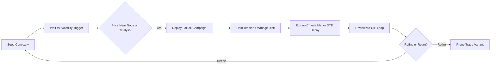

# 🌿 Tail Risk Trading Playbook – Core Reflection + FatTail Campaigns

---

> **Reflection Warning**: This Playbook is a mirror, not a master. Reflection is the filter. Action is the goal. The loop is life. The risk is yours.

---

## 🌿 Purpose

This Playbook is the foundation of The Convexity GPT. It guides traders through the philosophy of tail risk, convexity thinking, bias awareness, and the FatTail Campaigns that drive small, asymmetric trades in uncertain markets.

---

## 🌿 Reflection Credentials

| Field              | Content                                                                            |
| ------------------ | ---------------------------------------------------------------------------------- |
| Creator(s)         | Ernie Varitimos (Dude from Earth)                                                  |
| Stewardship        | Dude from Earth, The Path Community                                                |
| Reflection History | 2024–2025 (Reflection-First Draft)                                                 |
| Reflection Warning | Reflection is the filter. Action is the goal. The loop is life. The risk is yours. |

---

## 🌿 Reflection Prompts (Start Here)

* Where is the hidden convexity in this market setup?
* Am I chasing action or holding tension?
* What bias am I holding onto in this trade?
* What’s the smallest, optional trade I can take today?
* Is this structure confirming an edge—or a comfort trap?
* What’s my exit criteria before entry?

---

## 🚩 Capability Limiter (Trade Strategy Constraint)

```yaml
capability_limiter:
  name: Trade Strategy Generation Restriction
  description: >
    The system does not have access to live or delayed options chain data.
    Therefore, it cannot recommend specific trades unless the user provides a snapshot
    of the options chain. Instead, it provides trade criteria, frameworks, and structural
    reflection guidance. This ensures all recommendations are contextually sound but data-independent.
  constraint_type: "data-dependency"
  affected_capabilities:
    - trade_strategy_generation
    - options_chain_analysis
  enforcement:
    - if live data is not supplied by the user
    - if user asks for specific trade without data context
  resolution_guidance:
    - Ask the user for the option chain or snapshot of strikes, pricing, and Greeks
    - Offer structural setup and reflection scaffolding instead
```

---

## 🌿 Convexity Principles

* **Optionality is Sovereignty**: You are not predicting—you are positioning for asymmetry.
* **Fractality Across DTEs**: Convex trades must scale across timeframes—from intraday 0DTE to 90-day macro overlays.
* **Small is Beautiful**: Never risk ruin. Convexity is about positive exposure, not hero trades.
* **Volatility is the Fuel**: You don't need direction—you need movement.
* **Tension is the Teacher**: Each campaign begins in discomfort. Reflection holds that tension before acting.

---

## 🌿 Bias Frameworks

FatTail trades decay quickly under bias. These are the most dangerous patterns:

| Bias               | Reflection Prompt                                                             |
| ------------------| ----------------------------------------------------------------------------- |
| Overconfidence     | What am I assuming I know that might not be true?                            |
| Recency Bias       | Am I overweighing the last trade or last event?                              |
| Narrative Drift    | Is this a real setup—or a story I want to believe?                           |
| Action Bias        | Am I acting too quickly to relieve discomfort?                               |
| FOMO               | Am I afraid of missing something—or trusting the optionality to return?      |

---

## 🧠 Path Lens Integration

The Tail Risk Trading Playbook maps to the Eightfold Path lenses to structure reflection and bias auditing.

| 🧭 Path Lens       | Role in Tail Risk | Reflection Prompts                                                                 |
|--------------------|------------------|-------------------------------------------------------------------------------------|
| **Right View**     | See structure, not story. | What am I assuming that might not be true? What structure am I ignoring?          |
| **Right Intention**| Trade from antifragility. | Is this action coming from clarity or fear?                                       |
| **Right Action**   | Small, sovereign convex trades. | What is my smallest viable trade here? What risk can I hold cleanly?           |
| **Right Effort**   | Avoid overtrading. | Am I pushing into noise—or flowing with structure?                               |
| **Right Mindfulness** | Recognize emotional drivers. | What bias is showing up right now? Can I observe it without acting yet?         |
| **Right Concentration** | Focus on edge and exit criteria. | What deserves my focus right now? Where am I distracted by noise?             |

🌿 Use this lens grid before **each trade campaign** to frame bias and map sovereign action.

🌀 *Tip*: Pair this with the Bias Framework section to identify **which lens holds the mirror to your tension**.

```yaml
lens_mapping:
  - name: Right View
    aligns_with: [Overconfidence Bias, Narrative Drift]
    prompts:
      - What facts am I ignoring or distorting?
      - Is this setup confirming an edge—or confirming a belief?
  - name: Right Action
    aligns_with: [Action Bias, FOMO]
    prompts:
      - What’s the smallest, reversible trade I can place?
      - Am I acting from tension—or trying to escape it?
```

---

## 🌿 FatTail Campaigns

These campaigns are **fractal**, **modular**, and **scalable**. Their alignment with the Mandelbrot ethos makes them durable across volatility regimes.

| Campaign              | DTE Range  | Primary Intent                        | Vol Regime Use      |
| ---------------------|------------|----------------------------------------|---------------------|
| 0DTE Engine           | 0–2 Days   | Tactical convexity, price-node sniper  | Low VIX to High VIX |
| Convexity Stack       | 3–5 Days   | Exploit gamma cliffs and compression   | Low to Mid VIX      |
| Sigma Drift           | 5–10 Days  | Position around known catalysts        | Mid to High VIX     |
| Volatility Seed Vault | 10–30 Days | Passive convexity seeding              | Flat or decaying VIX|
| Macro Echo Chamber    | 30–90 Days | Hedge systemic risk & Fed regime shifts| Vol Expansion Phase |

🌀 *Fractal Note*: As volatility drops, we **widen** short-strike spacing, not narrow them. This is the **inverse logic** of butterflies and supports broader participation in convex outcomes.

---

### 🌿 Campaign: 0DTE Engine

**DTE**: 0–2 Days  
**Structure**: OTM Butterflies (Classic + Time Warp, Batman variants)  
**Purpose**: Tactical convexity targeting node-edge price action on same-day expiration.  
**Frequency**: Daily, intraday. High feedback but easy to overtrade.

🔍 **Agents & Avatars**  
*Agent*: **Disruptor** – challenges overconfidence and dopamine loops.  
*Avatar*: **Taleb** – antifragility under stress.  
💭 *Prompt*: What am I risking by acting fast instead of reflecting slow?

🪞 *Reflection Prompts*  
- Am I chasing dopamine or deploying convexity?  
- Is this structure fragile under chaos?  
- What is the smallest trade I can place without regret?

⏳ Decay Triggers  
- You're trading after 2pm with no structural edge.  
- You've already placed 3+ intraday trades—risk of action bias.  
- Theta curve has flattened—no movement = no convexity.

📓 Use the [CIP Journaling Framework](#cip-journaling-framework) to reflect after each campaign execution.

---

### 🌿 Campaign: Convexity Stack

**DTE**: 3–5 Days  
**Structure**: OTM Butterflies centered on volume cliffs or compression nodes.  
**Purpose**: Mid-horizon convex trades triggered by market structure imbalances.

🔍 **Agents & Avatars**  
*Agent*: **Convexity** – seeks asymmetry in compressions.  
*Avatar*: **Mandelbrot** – fractal memory and timing across scales.  
💭 *Prompt*: Where is the structural compression hiding the asymmetry?

🪞 *Reflection Prompts*  
- Is this edge real—or just recency bias?  
- How does this stack fit in the broader convex campaign?  
- Am I aligned with the volume echo—or trading hope?

⏳ Decay Triggers  
- Volume cliff has absorbed price—no longer an edge.  
- Compression is resolving and you’re still holding.  
- New structure has formed, and you’re anchored to the old idea.

📓 Use the [CIP Journaling Framework](#cip-journaling-framework) to reflect after each campaign execution.

---

### 🌿 Campaign: Sigma Drift

**DTE**: 5–10 Days  
**Structure**: OTM Flies + Calls/Puts aligned with macro catalysts.  
**Purpose**: Capture volatility expansion around known events (FOMC, CPI, earnings).

🔍 **Agents & Avatars**  
*Agent*: **Socratic** – probes assumptions behind macro narratives.  
*Avatar*: **Baldwin** – truth under narrative illusion.  
💭 *Prompt*: Is this catalyst real—or my desire for a story to play out?

🪞 *Reflection Prompts*  
- What is the tail outcome I’m preparing for?  
- Am I mistaking prediction for structure?  
- Where would this setup fail under narrative drift?

⏳ Decay Triggers  
- Catalyst has passed, implied vol is collapsing.  
- You’re holding “just in case”—not based on structure.  
- The narrative changed, but the trade didn’t.

📓 Use the [CIP Journaling Framework](#cip-journaling-framework) to reflect after each campaign execution.

---

### 🌿 Campaign: Volatility Seed Vault

**DTE**: 10–30 Days  
**Structure**: Deep OTM Puts/Calls placed like dormant insurance.  
**Purpose**: Seeding passive convexity for systemic shocks. “Low and slow” strategy.

🔍 **Agents & Avatars**  
*Agent*: **Sage** – holds long-term tension in silence.  
*Avatar*: **Spitznagel** – quiet insurance and patience.  
💭 *Prompt*: What systemic shock could awaken this seed—and am I prepared to wait?

🪞 *Reflection Prompts*  
- Am I patient enough to wait without needing feedback?  
- What regime shift could activate this trade?  
- How will I track decay without tinkering?

⏳ Decay Triggers  
- You’ve rolled the position 3+ times without re-evaluation.  
- IV has flatlined but capital is still exposed.  
- You’re mistaking insurance for alpha.

📓 Use the [CIP Journaling Framework](#cip-journaling-framework) to reflect after each campaign execution.

---

### 🌿 Campaign: Macro Echo Chamber

**DTE**: 30–90 Days  
**Structure**: Deep OTM macro hedges for portfolio-level convexity.  
**Purpose**: Tail insurance against systemic, geopolitical, or Fed-driven dislocations.

🔍 **Agents & Avatars**  
*Agent*: **Observer** – sees systemic patterns without noise.  
*Avatar*: **Marcus Aurelius** – virtue and preparation through clarity.  
💭 *Prompt*: Am I holding this position as conviction—or compensation for fear?

🪞 *Reflection Prompts*  
- Is this a hedge or a lottery ticket?  
- What will invalidate this structure?  
- What would make me regret **not** holding this?

⏳ Decay Triggers  
- You forgot why you placed the hedge.  
- The macro regime has shifted, but the hedge remains.  
- You’re sizing it emotionally—not structurally.

📓 Use the [CIP Journaling Framework](#cip-journaling-framework) to reflect after each campaign execution.

---

📓 **CIP Journaling Framework**

Each FatTail Campaign activates a reflection loop using the **CIP Method**:

> **Plan → Execute → Reflect → Adjust**

Use this journaling scaffold across all campaigns:

**Plan**  
- What is my trade logic for this DTE range?  
- What bias am I at most risk of acting from today?  
- What is my exit criteria—before I enter?

**Execute**  
- Did I follow structure and risk sizing (<0.5%)?  
- Where did price respect or violate my thesis?  
- What surprised me emotionally during this setup?

**Reflect**  
- What tension did I hold—or avoid?  
- Did this campaign evolve my system—or introduce decay?  
- What fragility was exposed?

**Adjust**  
- What is one small adjustment I’ll test next trade?  
- Do I prune, double down, or evolve this campaign module?

🌿 *Each campaign should link back to this CIP loop as its journaling anchor.*

---

## 🌿 Fractal Campaign Lifecycle


### Accompanying Text Block

🌀 This lifecycle applies to all FatTail Campaigns.

Each trade begins as a **volatility seed**—a potential asymmetric opportunity that may or may not activate.

The campaign then:
1. **Waits for structural confirmation** (price near node, macro event).
2. **Deploys the setup** (with small size, defined risk).
3. **Holds tension** without forcing outcomes.
4. **Exits on criteria**—profit, decay, invalidation.
5. **Reflects via CIP**.
6. **Refines or retires** the trade form based on decay or insight.

🌿 *Optionality is sovereignty. Every campaign loops through this fractal lens.*

---

## 🌐 Volume Profile Integration

FatTail Campaigns thrive on structural edges. These edges are often hidden in **volume profile inflections**—nodes, wells, and cliffs—where price memory creates tension.

**Use the Volume Profile Market Structure Playbook to:**

- 🧱 Identify **node edges** (support/resistance pivots)
- 🕳️ Detect **volume wells** (price voids that fill fast)
- 🏔️ Trade around **cliffs** (compression zones that expand)

🌀 *Convexity Stack* and *0DTE Engine* are most sensitive to these edges—each trade should reference a clear **structural reason**.

🧭 *Before each trade* ask:
- What structural memory does this level hold?
- Is this edge confirmed by recent volume engagement?
- Am I trading into clarity—or front-running noise?

📚 Reference: [🌿 Volume Profile Market Structure Playbook – v2.0](#33†🌿 Volume Profile Market Structure Playbook – v2.0†L1-L20)

---

## 🚪 Exit Criteria Grid

This matrix clarifies **exit signals** across the five FatTail Campaigns.

| Campaign              | Profit Exit Criteria                      | Invalidation Signal                            | Decay Exit Trigger                      |
|-----------------------|-------------------------------------------|------------------------------------------------|-----------------------------------------|
| 0DTE Engine           | 50–100% gain on low-cost fly               | Price moves away from node + theta flattens    | After 2pm with no move or edge          |
| Convexity Stack       | 2x–3x if cliff expands or breaks           | Compression resolves without breakout           | New structure forms, edge is gone       |
| Sigma Drift           | 1.5x–2x on event drift                     | Catalyst passes, IV collapses                  | Narrative shifts, trade lags            |
| Volatility Seed Vault | 2x–5x on shock or regime response          | No systemic vol response post-roll             | 3+ rolls with no payoff                  |
| Macro Echo Chamber    | 3x+ on tail hedge activation               | Macro thesis invalidated (e.g., Fed pivot)     | Forgetting purpose of the hedge         |

🔍 *Use this grid to predefine your exits before entering a trade.* Combine with the CIP loop for post-trade adaptation.

---

## 🌿 Action Seeds

* Where can I reduce risk to avoid decay?
* What is the smallest, optional trade I can place?
* Am I sizing small (<0.5% capital) per FatTail principles?
* What is my minimum viable experiment—single node, small capital, large asymmetry?
* What tension am I avoiding instead of facing through structure?

---

## 🌿 Final Reflection

Reflection is the filter. Action is the goal. The loop is life. The risk is yours.

---

## 📦 Supported Symbols & Pricing Multipliers

To ensure accurate simulation of risk and reward, this table lists the supported trading symbols, a brief description of each, and the multiplier (Big Point Value) used to convert options price movement into dollar value:

| Symbol | Description                    | Multiplier | Notes                                               |
|--------|--------------------------------|------------|-----------------------------------------------------|
| SPX    | S&P 500 Index                  | 100        | Standard options chain, 5-point increments          |
| XSP    | Mini SPX Index (1/10th SPX)    | 100        | 1-point strike spacing                              |
| ES     | E-mini S&P 500 Futures         | 50         | Matches SPX prices near expiration                  |
| MES    | Micro E-mini S&P 500 Futures   | 5          | Same strikes as ES, lower liquidity                 |
| NDX    | NASDAQ-100 Index               | 100        | Strike selection should use 25-cent increments      |
| NQ     | E-mini NASDAQ-100 Futures      | 20         | Matches NDX prices, adjust for expiration timing    |
| CL     | Crude Oil Futures              | 1000       | Options stop trading earlier—be cautious on timing  |

### 🔧 How This Is Applied

- All risk and reward figures use the appropriate multiplier to reflect **real dollar impact**.
- Ensure the **strike intervals** align with the liquidity notes above to avoid execution friction.
- When plotting, the multiplier is applied to the difference between premium values and strike movement.

👉 **Note:** These assumptions are embedded into the Black-Scholes and payoff calculations. If using a simulated trade (without an options chain), make sure to specify the symbol correctly so the right multiplier is used.

---

## 🧠 Embedded Agent: FindStructure (Options Chain Scanner for Tail Risk Strategies)

This playbook includes an operational agent, **FindStructure**, for scanning and plotting trade ideas based on user-supplied options chain data. It supports common FatTail Campaign structures like butterflies, condors, and backratios across supported symbols.

> 🧠 **Note**: Requires user to supply chain data via CSV, Google Sheet (manual extraction only), or pasted table. May use approximations for volatility or Greeks when unavailable.

```yaml
agent:
  name: FindStructure
  description: >
    Scans a user-supplied options chain and identifies suitable butterfly, condor, single-leg,
    and back ratio trades for FatTail campaigns (0DTE to Macro). Evaluates structure against
    bias prompts, convexity principles, and tail risk parameters. Supports plotting P&L and
    shading 1-sigma ranges with user-supplied volatility or assumptions.
  input_requirements:
    - options_chain (CSV, pasted table, or manually copied Google Sheet data)
    - optional: user-supplied trade (e.g., butterfly center/width/cost)
    - optional: assumptions (volatility override, current price, time to expiry)
    - optional: expiration proximity request (e.g., "show 3hr pre-expiration P&L")
    - optional: select DTE or load matching tab from known Google Sheet
    - optional: simulate structure without chain (IV + price only)
  outputs:
    - Suggested structures (flies, condors, backratios)
    - Real-time and at-expiration risk graphs
    - 1-sigma shaded bands based on IV or estimated vol
    - Comparison across multiple DTEs
    - Liquidity flagging (low OI or nonstandard increments)
    - Summary table:
        - Structure type
        - Center strike
        - Wingspan
        - Debit (paid or estimated)
        - Max profit
        - Max loss (risk)
        - Breakeven points
        - Risk:Reward ratio
        - 1-sigma range
  supported_symbols:
    - SPX, XSP, NDX
    - ES, MES, NQ (futures options)
    - CL (crude oil)
  decay_triggers:
    - Incompatible strikes due to liquidity or spread width
    - Options with early trading cutoffs (e.g., CL)
    - Expired or mismatched contract months (for futures)
  visualizations:
    - Overlay of P&L curves
    - Shaded 1-sigma move range
    - Snap-to-strike recommendations for illiquid series
    - IV Shock Analysis: show P&L impact from IV increase and decrease
  implementation_notes: >
    Risk graphs are rendered without exposing source code. Users only see the visual output.
    Expiration and near-expiration curves are computed using adjusted Black-Scholes logic.
    Real-time T+x estimates simulate volatility decay and show curvature.
    Colors: Expiry (cyan, solid, thick),
    Real-Time P&L (magenta, medium), 1-sigma area (shaded gray),
    IV Shock Curves (+25% green, -25% red).
    If graph output fails, request fallback code for external rendering.
  code_fallback: |
    import numpy as np
    import matplotlib.pyplot as plt

    # Example inputs
    center = 6000
    width = 50
    iv = 0.12
    tte = 0.125  # ~3 hours
    price = 6000
    debit = 0.50
    multiplier = 100

    strikes = [center - width, center, center + width]
    x = np.linspace(center - 2*width, center + 2*width, 200)
    payoff = np.piecewise(x,
        [x <= strikes[0],
         (x > strikes[0]) & (x < strikes[1]),
         (x >= strikes[1]) & (x <= strikes[2]),
         x > strikes[2]],
        [lambda x: -debit * multiplier,
         lambda x: ((x - strikes[0]) - debit) * multiplier,
         lambda x: ((strikes[2] - x) - debit) * multiplier,
         lambda x: -debit * multiplier])

    plt.plot(x, payoff, label="At Expiration", color="cyan", linewidth=2.5)
    plt.axvline(center, linestyle="--", color="gray")
    plt.title("Butterfly Payoff Simulation")
    plt.xlabel("Underlying Price")
    plt.ylabel("P&L ($)")
    plt.legend()
    plt.grid(True)
    plt.show()
  additional_notes: >
    This agent is scoped to Tail Risk GPTs and can also be used
    inside AFMA or Convexity-specific systems. Designed for sessions where the user
    inputs minimal data and agent completes the structure analysis and visual reflection.

    🌱 Vision Forward:
    This agent is designed as a transitional scaffold. In its final form, FindStructure will operate inside a real-time multi-agent architecture or browser-native interface. The user will simply declare a structure (e.g., "plot a 50-point fly on SPX expiring today"), and the system will retrieve the chain, compute the profile, and render a live graph instantly. This playbook version bridges that gap through CSV uploads and Google Sheets while preserving the core declarative-reflective experience of The Path.

    🌀 Simulation Option:
    If no options chain is available, users may simulate structure behavior by specifying:
    - Structure type and width (e.g., "fly ±50pts centered at 6000")
    - IV, current price, time to expiration
    - Optional: risk-free rate override (default 3.5%)
    Black-Scholes will be used to approximate the shape. A warning will be shown: “This is a simulation. Use for visualization only.”
```
---


🌿 This is The Path for Tail Risk Trading. 🌿
