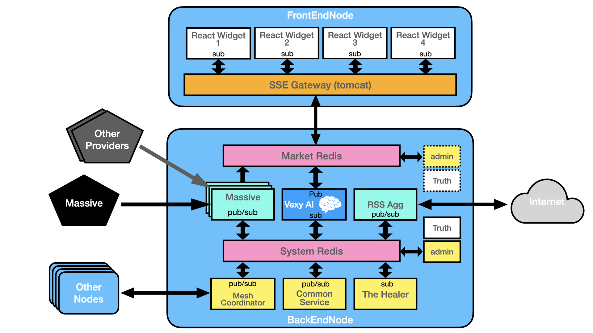

# # MarketSwarm — Architecture & Deployment

High-level map of how the pieces fit, how they are deployed with Docker, and how the **Universal Truth** drives configuration. Use this with the separate **Admin Guide** for exact commands.

⸻

### 1) System at a Glance


* **Market Redis** – high-volume, time-sensitive data (ticks, snapshots, RSS items, analysis results).
* **System Redis** – control plane (heartbeats, service registry, logs/telemetry).
* **Massive** – market-data gateway (Polygon → Massive rebrand). Publishes prices/snapshots into **Market Redis**.
* **RSS Agg** – ingests configured RSS feeds and publishes items into **Market Redis**; also enqueues work for Vexy.
* **Vexy AI** – consumes RSS/market items from **Market Redis**, produces summaries/analysis back into **Market Redis**.
* **Mesh Coordinator / Logger / Heartbeat** – coordination, central logging, and liveness reporting in **System Redis**.
* **SSE Gateway** – reads streams from **Market Redis** and fans out to web clients (Server-Sent Events to React widgets).
* **admin** – host-side tool that loads the **Universal Truth** into Redis and wires services via self-discovery.

⸻

### 2) Universal Truth

**Truth** is the single source of configuration. It is merged from two local files on the admin’s machine:
* truth.json – public/non-secret config (components, categories, defaults, metadata)
* truth_secrets.json – secrets per component (API keys, tokens, UA strings)

⠀
The admin loads it into Redis with ./admin load-truth. This writes:
* truth:doc – the merged JSON (never committed to git)
* truth:version – version string
* truth:ts – epoch when loaded

⠀
### Component Metadata

Each component entry may include:
```json
"components": {
  "rss_agg": {
    "meta": {
      "name": "RSS Ingestor",
      "description": "Polls configured RSS feeds…",
      "service_id": "rss_agg"
    },
    "...component config..."
  },
  "massive": {
    "meta": { "name": "Massive", "description": "Market data gateway", "service_id": "massive" }
  },
  "vexy_ai": {
    "meta": { "name": "Vexy AI", "description": "Summarizes/analyzes", "service_id": "vexy_ai" }
  }
}
```
Services never need file paths; they fetch their config from truth:doc at runtime.

⸻

### 3) Self-Discovery & Registration

Services identify themselves with:
* SERVICE_ID (e.g., rss_agg, massive, vexy_ai)
* BOOTSTRAP_REDIS_URL (inside Docker: redis://main-redis:6379; host admin: redis://localhost:6379)

⠀
The admin registers service→component mappings:
* svc:list – set of all service IDs
* svc:cfg:<service_id> – hash containing:
  * component – key under truth.components to read its config
  * secret_scope – key under truth.secrets to read its secrets (defaults to component name)

⠀
Example:
```text
svc:list                  = {rss_agg, massive, vexy_ai}
svc:cfg:rss_agg           = {component: rss_agg, secret_scope: rss_agg}
svc:cfg:massive           = {component: massive, secret_scope: massive}
svc:cfg:vexy_ai           = {component: vexy_ai, secret_scope: vexy_ai}
```

⸻

### 4) Data Flow (Happy Path)
1. **admin** loads truth → truth:doc.
2. **rss_agg** reads its config → polls feeds → publishes items:
   * rss:item:<uid> = full JSON of the item
   * rss:index (ZSET) = UIDs scored by published timestamp
   * rss:queue (STREAM) = work units for downstream consumers (e.g., Vexy)
3. **vexy_ai** reads from rss:queue as a **consumer group**, enriches/summarizes:
   * rss:analysis:<uid> = JSON summary
   * optionally publishes to rss:analysis:index (ZSET) and emits events for the SSE Gateway
4. **massive** connects to Massive APIs (REST/WS), writes to **Market Redis**:
   * market:tick:<symbol>:stream (STREAM) – ticks
   * market:snapshot:<symbol> (HASH/JSON) – latest snapshot
   * market:events (PUB/SUB or STREAM) – structural/system events
5. **SSE Gateway** subscribes/reads from **Market Redis** and fans out to React widgets.
6. **Mesh Coordinator / Heartbeat / Logger** operate on **System Redis** for control-plane telemetry.

⠀
⸻

### 5) Redis Schema (recommended keys)

### Market Redis (hot path)
* market:tick:<symbol>:stream (STREAM) — tick events
* market:snapshot:<symbol> (HASH/JSON) — latest
* rss:item:<uid> (JSON string)
* rss:index (ZSET ts→uid)
* rss:queue (STREAM) — ingest → analysis work queue
* rss:analysis:<uid> (JSON string)
* rss:analysis:index (ZSET ts→uid)
* events:market (STREAM or PUB/SUB)

⠀
### System Redis (control plane)
* truth:doc (JSON string)
* truth:version, truth:ts
* svc:list (SET), svc:cfg:<service> (HASH)
* svc:hb:<service> (STRING epoch)
* log:<channel>:stream (STREAM) e.g., log:errors:stream, log:heartbeats:stream

⠀
Adjust stream retention with XTRIM MAXLEN if needed.

⸻

### 6) Docker Deployment

All services run on the default Compose bridge network:
* **Service DNS**: containers resolve each other by service name (main-redis, market-redis, rss_agg, massive, …).
* **Host Access**: bind **only** what you need to localhost (e.g., main-redis: 127.0.0.1:6379:6379) for admin access.
* **Healthchecks**: each service defines a light probe (DNS/HTTPS or Redis ping); Compose restarts unhealthy services.
* **Restart Policy**: typically unless-stopped.

⠀
Example (Redis primary):
```yaml
main-redis:
  image: redis:7-alpine
  command: ["redis-server", "--appendonly", "yes"]
  healthcheck:
    test: ["CMD", "redis-cli", "ping"]
    interval: 10s
    timeout: 3s
    retries: 5
    start_period: 5s
  ports:
    - "127.0.0.1:6379:6379"   # host-only for admin
  restart: unless-stopped
```
> **Note**: Inside Docker, services talk to redis://main-redis:6379. 
> On the host, admin uses redis://localhost:6379.

### Service Environment (typical)
```yaml
environment:
  SERVICE_ID: "rss_agg"                       # or "massive" / "vexy_ai"
  BOOTSTRAP_REDIS_URL: "redis://main-redis:6379"
```
No secrets are passed via env; services fetch from truth:doc using their mapping.

⸻

### 7) Component Notes

### 7.1 Massive (market data)
* **Purpose**: connects to Massive (ex-Polygon) REST + WebSocket to ingest live/near-live market data.
* **Truth**:
  * components.massive.market_redis_setup.init_keys for bootstrap namespaces
  * secrets under secrets.massive.api_key
* **Output**:
  * snapshots (market:snapshot:<symbol>)
  * ticks (market:tick:<symbol>:stream)
  * optional events (events:market)
* **Consumers**:
  * React widgets via SSE Gateway
  * Research/analytics workers
  * Vexy (optional) can join for sentiment/context overlays

⠀
### 7.2 RSS Agg (news)
* **Purpose**: poll configured feeds by **categories** with enabled_categories.
* **Truth**:
  * components.rss_agg.poll_interval_min
  * components.rss_agg.categories.{tech,world,macro,...}
  * secrets under secrets.rss_agg.user_agent
* **Output**:
  * items: rss:item:<uid> + rss:index
  * work queue: rss:queue (STREAM) → Vexy consumer group: vexy

⠀
### 7.3 Vexy AI (analysis)
* **Purpose**: summarize/analyze items (RSS and/or market events), write back to Redis.
* **Truth**:
  * components.vexy_ai.model
  * components.vexy_ai.prompt_template
  * secrets under secrets.vexy_ai.openai_api_key
* **Input**:
  * Group on rss:queue (e.g., group vexy, consumers vexy-1, vexy-2, …)
* **Output**:
  * rss:analysis:<uid> JSON
  * rss:analysis:index (ZSET)
  * optional event emission for SSE Gateway

⠀
Conor: you’ll primarily consume Massive’s market:* keys from **Market Redis** and the rss:* analysis keys for blended signals.

⸻

### 8) Observability
* **Heartbeats**: each service updates svc:hb:<service_id> at its configured cadence (defined under truth.heartbeats).
* **Logs**:
  * App logs to stdout (captured by Docker).
  * Optional structured logs to log:<channel>:stream in **System Redis** (heartbeats, errors, etc.).
* **Healthchecks**:
  * Containers define lightweight DNS/HTTP/Redis checks to avoid cascading crashes.

⠀
⸻

### 9) Security & Secrets
* Secrets live only in **truth_secrets.json on the admin machine** (git-ignored).
* Admin merges secrets into Redis (truth:doc). Services **read** and never print secret values.
* **Redis host binding** is 127.0.0.1 for admin access; do not expose externally.
* No secrets in Compose env or images.

⠀
⸻

### 10) First Run (bird’s-eye)
1. **Start Redis**:
```bash
docker compose up -d main-redis
```

2. **Admin bootstrap (host)**:
```bash
./admin setup
./admin load-truth
./admin components
./admin register --service-id rss_agg --component rss_agg
./admin register --service-id massive --component massive
./admin register --service-id vexy_ai --component vexy_ai
```

4. **Verify flow**:
   * rss_agg publishes items → rss:index, rss:item:*, rss:queue
   * vexy_ai consumes rss:queue → writes rss:analysis:*
   * massive writes market:* streams/snapshots

⠀
⸻

### 11) Scaling & Extensions
* **Horizontal scale**: run multiple consumers in a Redis **consumer group** (Vexy, SSE Gateway workers).
* **Retention**: XTRIM for streams; TTLs for item/analysis keys if storage pressure rises.
* **Backpressure**: per-category polling limits (RSS), per-symbol subscriptions (Massive), work-queue rate limits (Vexy).

⠀
⸻

### 12) Troubleshooting (quick)
* **Host can’t reach Redis service name**: use redis://localhost:6379 on host; service names only resolve inside Docker.
* **Admin complains about redis module**: run ./admin setup (installs into ./.venv used by the wrapper).
* **Compose volume parse error with truth paths**: ensure truth loading happens via the **admin tool**, not via Compose placeholders.
* **Service restarts with code 0**: likely the Python module exited cleanly (nothing to do) or missing env SERVICE_ID. Check logs.

⠀
⸻

### 13) What Conor Needs for Vexy
* **Inputs**:
  * rss:queue (STREAM): XGROUP CREATE rss:queue vexy $ MKSTREAM (admin or first worker)
  * Optional: Massive feeds in market:tick:* and market:snapshot:*
* **Outputs**:
  * rss:analysis:<uid> JSON and rss:analysis:index (ZSET)
* **Config/Secrets** from truth:doc via svc:cfg:vexy_ai mapping:
  * components.vexy_ai.model
  * components.vexy_ai.prompt_template
  * secrets.vexy_ai.openai_api_key
* **Env (inside Docker)**:
```yaml
environment:
  SERVICE_ID: "vexy_ai"
  BOOTSTRAP_REDIS_URL: "redis://main-redis:6379"
```

* **Market Redis consumption**: subscribe/read market:* keys to enrich summaries with live context.

⠀
⸻

### 14) Appendix — Key Conventions
* **Truth keys**: truth:doc, truth:version, truth:ts
* **Service registry**: svc:list, svc:cfg:<service>, svc:hb:<service>
* **RSS**: rss:index (ZSET), rss:item:<uid> (STRING JSON), rss:queue (STREAM), rss:analysis:<uid> (STRING JSON)
* **Market**: market:tick:<symbol>:stream, market:snapshot:<symbol>
* **Logs**: log:<channel>:stream

